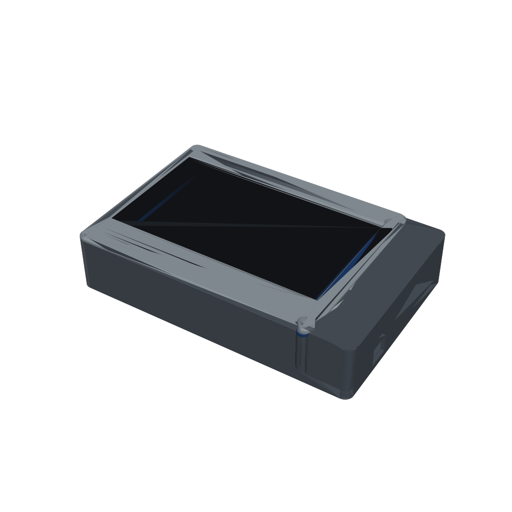
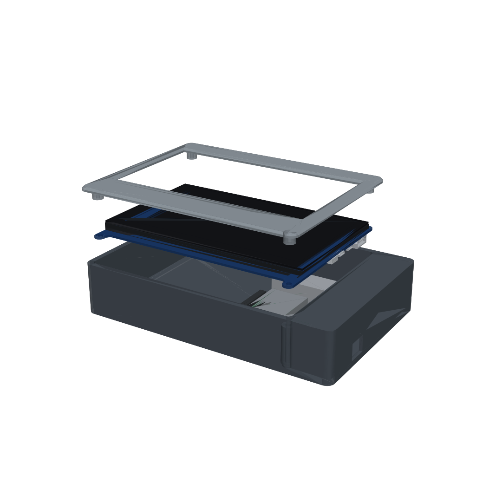

# MPI7002 7" HDMI Touch Display — CAD models & Linux notes

> 🤖 **An LLM experiment.** Everything in this repository — the CAD
> models, the printable enclosure, the renders, and these docs — was
> generated with an LLM (Claude, via Claude Code), starting from nothing
> but a part reference and the manufacturer's published documentation.





CAD models, a 3D-printable enclosure, and Linux setup notes for the
LCDwiki **MPI7002** / *7inch HDMI Display-C* — a 7" 1024x600 IPS panel
with five-point capacitive touch, sold under many brand names (Hosyond,
OSOYOO, and others). If your panel's EDID reports `MPI7002` and the touch
controller enumerates as USB `0484:5750`, this is your display.

Full specifications and datasheets:
[lcdwiki.com/7inch_HDMI_Display-C](https://www.lcdwiki.com/7inch_HDMI_Display-C)

## Why this repo

This is an experiment in building accurate, printable CAD designs from
nothing but a part reference: no calipers, no vendor STEP files — just
the manufacturer's published outline drawing and product images, read
carefully (including reconciling contradictions between drawing views),
turned into parametric CadQuery models, and validated with programmatic
dimension and collision checks.

## CAD Models

Everything lives in `cad/` and regenerates from the scripts in `scripts/`:

- `cad/MPI7002.step` / `.stp` - display module (PCB with eared outline,
  screen stack, HDMI / micro-USB / switch connectors) for CAD assemblies
- `cad/MPI7002.3mf` - mesh export of the display model (reference only)
- `cad/MPI7002_front_panel.step` / `.stp` / `.3mf` - printable front
  bezel; the display screws to it through its four mounting-ear holes.
  The 3MF is print-oriented — slice as-is, no supports.
- `cad/MPI7002_case_back.step` / `.stp` / `.3mf` - printable back case
  with an internal Raspberry Pi 5 bay and cable compartment; four M3 x 35
  screws clamp case, display, and panel. The 3MF is print-oriented.
- `cad/MPI7002_panel_assembly.step` - display + panel reference assembly
- `cad/MPI7002_case_assembly.step` - display + panel + case + Pi 5
  reference assembly
- `cad/*_github_preview.stl` - open these on GitHub for the built-in 3D
  viewer
- `cad/README.md` - dimensions, coordinate system, accuracy notes, screw
  sizes, and print settings

Dimensions come from the official outline drawing
([MPI7002_Size.pdf](https://www.lcdwiki.com/res/MPI7002/MPI7002_Size.pdf));
connector body sizes are standard receptacle dimensions. Caliper-check the
mounting-hole spacing (expected `156.90 x 114.96 mm`) before drilling or
committing a print.

## Display Setup (Linux / X11)

The panel is plug-and-play over HDMI (native mode `1024x600 @ 60 Hz`) and
shows up like any monitor. If it is detected but not enabled, turn it on
with XRandR — find its output name with `xrandr --query`, then:

```bash
xrandr --output <OUTPUT> --mode 1024x600 --pos <X>x<Y>
```

## Touch Mapping

Touch arrives as a USB HID multitouch device named `QDTECH MPI700
MPI7002` (`0484:5750`) and works out of the box on a single-monitor
setup. On multi-monitor setups, map the touch area to the panel's output:

```bash
xinput list                        # find the device id
xinput map-to-output <ID> <OUTPUT>
```

The id can change after reboot or replug, so look it up rather than
hardcoding it.

## Brightness

The panel exposes no kernel backlight device and no DDC; the hardware
control is the physical backlight switch next to the ports. In software
you can scale the rendered image intensity per-output:

```bash
xrandr --output <OUTPUT> --brightness 0.7    # 0.05..1.0 useful range
```

The `7in-brightness` script wraps this; point it at your output with the
`DISPLAY_OUTPUT` environment variable (defaults to `DP-4`):

```bash
export DISPLAY_OUTPUT=DP-4   # your panel's XRandR output name
./7in-brightness get
./7in-brightness set 0.70
./7in-brightness up
./7in-brightness down
./7in-brightness loop        # sweep 0% -> 100% in 10% steps
```

Values below ~0.05 effectively blank the output; `1.00` is normal.

## Hardware Identification

- EDID display name and serial text: `MPI7002`
- Touch controller: `QDTECH MPI700 MPI7002`, USB `0484:5750` (HID
  multitouch, STM32-based)
- EDID-reported physical size is bogus (`255mm x 255mm`); the real active
  area is `154.21 x 85.92 mm`

Raw detection logs from a first bring-up (XRandR, EDID, DRM, USB, touch
calibration) are in [OBSERVED_STATE.md](OBSERVED_STATE.md).

## Regenerating the CAD Models

```bash
uv venv .venv-cad --python 3.11
uv pip install --python .venv-cad/bin/python -r requirements-cad.txt
.venv-cad/bin/python scripts/generate_step.py    # display model
.venv-cad/bin/python scripts/generate_panel.py   # front panel
.venv-cad/bin/python scripts/generate_case.py    # back case + assemblies
.venv-cad/bin/python scripts/render_previews.py  # README render images
```

See `cad/README.md` for validation steps and expected outputs.
